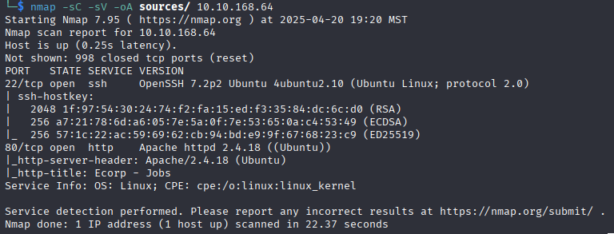
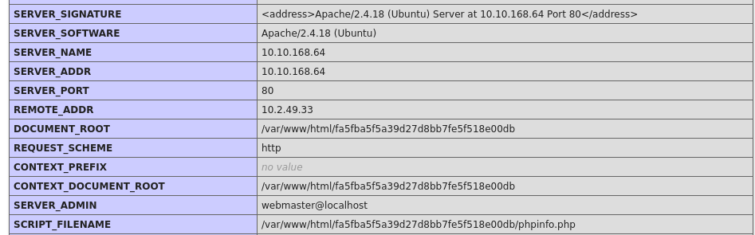
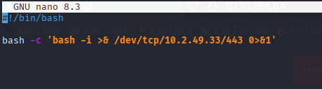
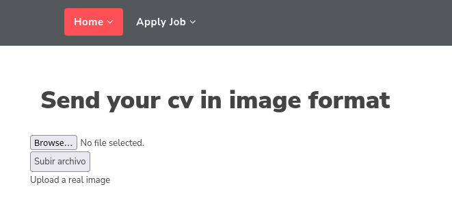
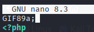
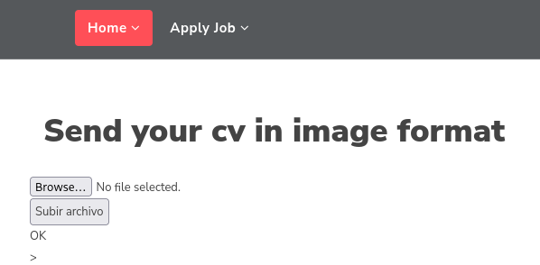
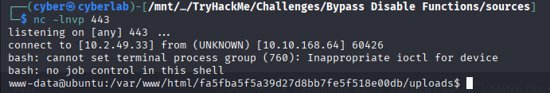
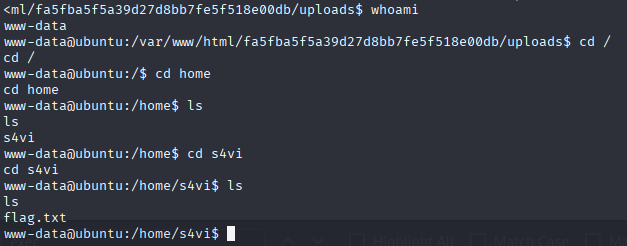

---
tags:
  - thm
  - challenges
  - red-team
  - beginner
  - walkthrough
  - netcat
  - chankro
title: Bypass Disable Functions
description: Practice bypassing disabled dangerous features that run operating system commands or start processes.
date: 2025-04-20
---

# Bypass Disable Functions

## Box Info

- **Difficulty:** Info
- **IP Address:** 10.10.168.64 (IP randomly assigned when starting machine)
- **Attack Vector:** PHP LD_preload
- **Flag Type:** User flag
- **Methodology:** Basic enumeration → craft deployable → access → retrieve flag

---

## Recon

### Nmap Scan

```bash
nmap -sC -sV -oA sources/ 10.10.168.64
```

- **Open Port(s):**  22/tcp open  ssh     OpenSSH 7.2p2 Ubuntu 4ubuntu2.10 (Ubuntu Linux; protocol 2.0)
80/tcp open  http    Apache httpd 2.4.18 ((Ubuntu))
> [!note]
> Nmap noted that port 80 is open. When visiting the site I noticed it was using php extensions so I manually checked for a phpinfo file in the root folder. We see that file uploads are enabled, we need to find the php file associated with this.

### Nmap Screenshot


### PHPInfo Screenshot

> [!note]
> Make note of the document root. When using Chankro to build our deployable we need to specify that folder as --path flag.

---

## Exploitation

### Step 1: Craft the payload
- **Command(s) Used:**
  ```bash
  nano command.php
  ```
- 
> [!note]
> This payload is a reverse shell, we're launching an interactive session and forwarding all output to my ip over port 443.

### Step 2: Wrapping the Payload with Chankro
- **Command(s) Used:**
```bash
python2 ~/Chankro/Chankro.py --arch 64 --input command.sh --output exploit.php --path /var/www/html/fa5fba5f5a39d27d8bb7fe5f518e00db
```
> [!note]
> The path is found in the phpinfo file that we found. Document Root. It's important that we get this correct or our exploit may not run correctly.
> See also: [[Chankro]] - Tool usage reference

### Step 3: Deploying the Payload
- We need to find where the upload page is located. This site appears to be a job listings page. There is an Apply Job page, we should check there.

> [!note]
> When we try to upload our exploit we get a warning that need to upload an image. There is probably some sort of check. Since we suspect the exploit will need to take advantage of php settings maybe adding a magic number will do the trick of bypassing the image filter.

### Step 4: Modifying Payload to Bypass Image Filter
- **Command(s) Used:**
```bash
nano exploit.sh
```
> [!note]
> We can use GIF89a; as the **first line** of the file to make the image filter believe that we're uploading a GIF file. Luckily the upload doesn't actually check file extensions or we'd have to be more creative.


### Step 5: Redeploy the Payload
- Reupload the file. This time we should get a message saying OK


### Step 6: Start a Listener
- **Command(s) Used:**
```bash
nc -lvnp 443
```
> [!note]
> This opens a listener on port 443 that will answer any incoming requests over that port from any inbound IP.

### Step 7: Execute the Exploit
- **Webpage Opened:** 10.10.168.64/uploads/exploit.php
- **Expected Output:** The page will just say GIF89a; But if we go back to our netcat listener we'll see a shell.


### Step 8: Find the Flag
- **Command(s) Used:**
```bash
whoami
cd /home
ls
cd s4vi
ls
cat flag.txt
```
- **Flag:** [Redacted]

---

## Notes

- Improperly configured php install allows putenv() function to override disable_functions
- Learn how to use Chankro and Netcat

---

## Tools Used

| Tool    | Purpose                                         |
| ------- | ----------------------------------------------- |
| nmap    | Port and service scan                           |
| chankro | Wraps shell scripts in php files                |
| netcat  | Listen on a given port for incoming connections | 
